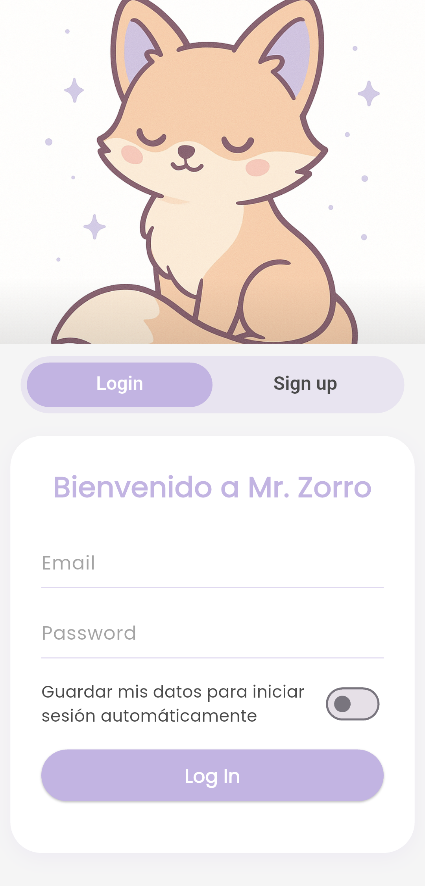
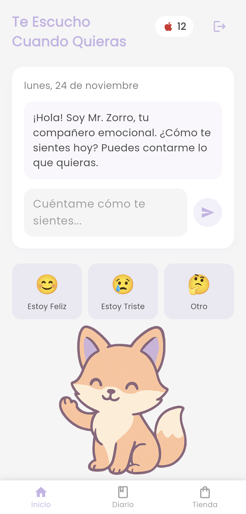
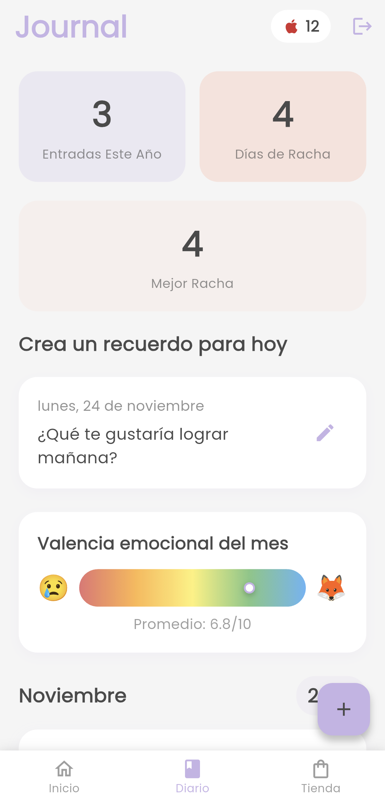
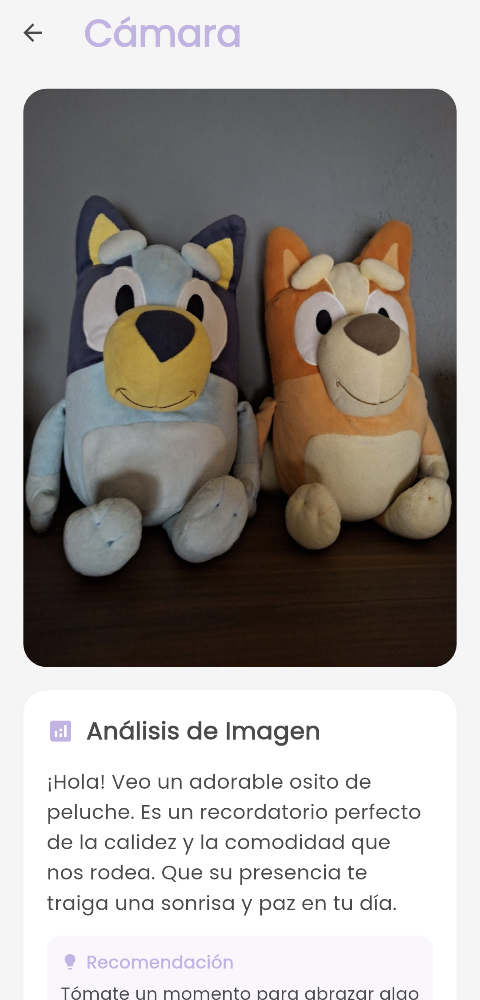
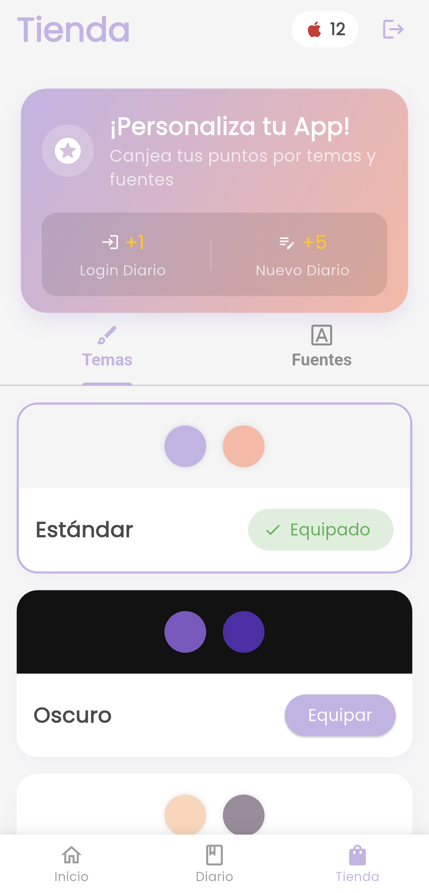

# 🦊 Mr. Zorro

Una aplicación avanzada de bienestar emocional desarrollada en Flutter que integra inteligencia artificial para proporcionar apoyo emocional personalizado, análisis de imágenes y seguimiento emocional inteligente.

## 📄 Documentación del proyecto

- **Documentación técnica**: [Mr. Zorro](.resources/docs/Documentacion_MrZorro.pdf)

## 🔗 Repositorios

Este proyecto es parte de un ecosistema más grande. Revisa los otros repositorios de sus componentes:

- **Backend API**: [mrzorro_api](https://github.com/jorgemp1270/mrzorro_api)
- **Embedded Device (ESP32)**: [mrzorro_esp32](https://github.com/jorgemp1270/mrzorro_esp32)

----

<p align="center">
  
</p>

----

## 📱 Screenshots

<p align="center">
  
  
  
</p>

<p align="center">
  
  
  
</p>

## ✨ Características Principales

### 🤖 Asistente de IA Emocional
- **Chat inteligente** con Mr. Zorro, tu compañero emocional personalizado
- **Respuestas contextuales** basadas en tu historial y estado emocional actual
- **Integración Gemini AI** para consejos personalizados y empáticos
- **Límite inteligente** de mensajes para mantener conversaciones focused (10 mensajes máx)
- **Soporte multiidioma** con respuestas naturales en español

### 🦊 Personalización de Mr. Zorro
- **Configuración de perfil** con edad objetivo (Niños, Adolescentes, Adultos)
- **Personalidad adaptable** con 9 opciones (Amigable, Profesional, Divertido, Sabio, etc.)
- **Contexto personalizado** mediante "Consideraciones especiales" y "Sobre mí"
- **Gestión de memoria** con opción para borrar el historial de conversación

### 📡 Conectividad IoT (ESP32)
- **Configuración Bluetooth** integrada en la app
- **Provisionamiento WiFi** seguro para el dispositivo físico
- **Sincronización automática** de credenciales y host API
- **Interacción física** complementaria a la app móvil

### 🔐 Sistema de Autenticación Avanzado
- **Registro seguro** con validación en tiempo real
- **Login automático** con credenciales cifradas
- **Flutter Secure Storage** para protección máxima de datos
- **Validación robusta** de email, contraseña y nickname
- **Gestión de sesiones** persistente y segura

### 📖 Diario Emocional Inteligente
- **Entradas agrupadas por mes** con navegación intuitiva
- **12 emociones diferentes** con valores numéricos (1-10 escala)
- **Selección visual de emociones** con chips interactivos
- **Promedio emocional mensual** mostrado en barra dinámica
- **Sincronización automática** de datos al crear/editar entradas
- **Historial completo** con fechas y previsualización

### 📷 Análisis de Imágenes con IA
- **Captura inteligente** con análisis automático
- **ResNet-50** para clasificación de imágenes
- **Gemini AI** para descripciones contextuales detalladas
- **Recomendaciones personalizadas** basadas en análisis visual
- **Datos curiosos** relacionados con las imágenes
- **Integración fluida** con entradas de diario
- **Almacenamiento inteligente** por fecha en dispositivo

### 🎭 Gestión Emocional Completa
- **Registro rápido** con botones de emociones principales
- **Análisis de tendencias** con promedio mensual visual
- **Colores dinámicos** que reflejan el estado emocional
- **Feedback inmediato** del sistema de IA
- **Seguimiento de progreso** emocional a lo largo del tiempo

### 🏠 Experiencia de Usuario Premium
- **Bottom navigation** con tres secciones principales
- **Material Design 3** con colores personalizados
- **Animaciones fluidas** y transiciones suaves
- **Responsive design** adaptado a diferentes pantallas
- **Dark/Light theme support** automático del sistema

### 🚨 Sistema de Alerta de Crisis
- **Detección de Nivel de Peligro**: Monitoreo constante del estado de riesgo del usuario.
- **Contactos de Confianza**: Gestión de lista de contactos para emergencias.
- **Alerta SMS Automática**: Envío de mensajes de ayuda con ubicación GPS en tiempo real.
- **Protocolo de Seguridad**: Activación automática de alertas (Nivel >= 3) y reseteo manual tras confirmación.
- **Integración con Mapas**: Enlace directo a Google Maps con coordenadas precisas.

## 🏗️ Arquitectura Técnica

### Frontend (Flutter)
```yaml
- Framework: Flutter 3.7.2+
- Lenguaje: Dart
- UI Pattern: StatefulWidget + setState
- Storage: flutter_secure_storage (cifrado)
- HTTP: http package con manejo de errores
- Images: image_picker + path_provider
- Auth: local_auth (biométrica)
- Location: geolocator (GPS)
- Launcher: url_launcher + flutter_phone_direct_caller
- Navegación: Material PageRoute
- Fonts: Google Fonts (Poppins)
- Internacionalización: intl package
```

### Backend Integration
```python
- Framework: FastAPI (Python)
- Base de Datos: MongoDB (JSON-based)
- IA: Google Gemini 2.5 Flash
- Análisis Visual: PyTorch + ResNet-50
- Validación: Pydantic
- CORS: Configurado para desarrollo
```

### Endpoints Implementados
```http
POST   /login           # Autenticación de usuario
POST   /signup          # Registro de nuevos usuarios
POST   /diary           # Crear/editar entradas de diario
GET    /diary/{user}    # Obtener todas las entradas
POST   /prompt          # Chat con IA (Gemini)
POST   /predict-image   # Análisis de imágenes con IA
GET    /settings/{user} # Obtener configuración de usuario
POST   /settings        # Actualizar configuración de usuario
DELETE /context/{user}  # Borrar memoria/contexto de conversación
GET    /contacts/{user} # Obtener contactos de confianza
POST   /contacts        # Agregar contacto de confianza
DELETE /contacts/{id}   # Eliminar contacto de confianza
GET    /danger-level/{user} # Obtener nivel de peligro del usuario
POST   /reset-danger-level/{user} # Resetear nivel de peligro a 0
```

## 🚀 Instalación y Configuración Completa

### Prerrequisitos del Sistema
Antes de comenzar, asegúrate de tener instalado lo siguiente:

- **Flutter SDK** >= 3.7.2 ([Descargar aquí](https://flutter.dev/docs/get-started/install))
- **Dart SDK** (incluido automáticamente con Flutter)
- **Git** para control de versiones ([Descargar aquí](https://git-scm.com/))
- **Android Studio** + Android SDK ([Descargar aquí](https://developer.android.com/studio))
- **VS Code** con extensiones Flutter/Dart (alternativa a Android Studio)
- **JDK** 17 o superior (para compilación Android)
- **Emulador Android** configurado o dispositivo físico con USB debugging

### 📥 Clonación del Repositorio

#### Opción 1: Clonar por HTTPS
```bash
# Clonar el repositorio principal
git clone https://github.com/jorgemp1270/mrzorro_app.git

# Navegar al directorio del proyecto
cd mrzorro_app

# Verificar que estás en la rama correcta
git branch
git status
```

#### Opción 2: Descargar ZIP
1. Ir a [GitHub Repository](https://github.com/jorgemp1270/mrzorro_app)
2. Click en "Code" → "Download ZIP"
3. Extraer el archivo a tu directorio de desarrollo
4. Abrir terminal en la carpeta extraída

### 🔧 Configuración Inicial del Entorno

#### 1. Verificación de Flutter
```bash
# Verificar instalación de Flutter
flutter doctor

# Si aparecen issues, solucionarlos uno por uno:
# - Android toolchain: Instalar/actualizar Android SDK
# - VS Code/Android Studio: Instalar plugins de Flutter/Dart
# - Emulador: Crear AVD desde Android Studio

# Verificar versión
flutter --version
```

#### 2. Configuración de Android
```bash
# Aceptar licencias de Android
flutter doctor --android-licenses

# Listar emuladores disponibles
flutter emulators

# Crear emulador si no tienes uno
# Desde Android Studio: Tools > AVD Manager > Create Virtual Device
```

### 🛠️ Compilación del Proyecto

#### Paso 1: Instalación de Dependencias
```bash
# Limpiar cache (recomendado para primer setup)
flutter clean

# Instalar todas las dependencias
flutter pub get

# Verificar que no hay conflictos
flutter pub deps
```

#### Paso 2: Configuración de API Backend
Actualizar configuración en `lib/config/api_config.dart`:

```dart
// Para desarrollo con emulador Android
static const String baseUrl = 'http://10.0.2.2:8000';

// Para dispositivo físico (cambiar por IP de tu PC)
static const String baseUrl = 'http://192.168.1.XXX:8000';

// Para backend en la nube (si aplicable)
static const String baseUrl = 'https://tu-backend-url.com';
```

#### Paso 3: Compilación y Ejecución

##### 🔍 Verificar Dispositivos Disponibles
```bash
# Listar todos los dispositivos conectados
flutter devices

# Ejemplo de salida:
# Chrome (web)      • chrome     • web-javascript • Google Chrome
# Android emulator  • emulator   • android        • android-x64
# iPhone Simulator  • ios        • ios-simulator  • iOS Simulator
```

##### 🏃‍♂️ Ejecutar en Modo Debug (Desarrollo)
```bash
# Ejecutar en el primer dispositivo disponible
flutter run

# Ejecutar en dispositivo específico
flutter run -d emulator-5554
flutter run -d chrome
flutter run -d "iPhone Simulator"

# Ejecutar con hot reload habilitado (automático en debug)
flutter run --hot
```

##### 🚀 Compilar Release (Producción)
```bash
# Para Android APK
flutter build apk --release

# Para Android App Bundle (recomendado para Google Play)
flutter build appbundle --release

# Para iOS (requiere macOS y Xcode)
flutter build ios --release

# Los archivos compilados se encuentran en:
# build/app/outputs/flutter-apk/app-release.apk
# build/app/outputs/bundle/release/app-release.aab
```

### 📱 Instalación en Dispositivos

#### Android APK
```bash
# Instalar APK en dispositivo conectado
flutter install

# O manualmente con ADB
adb install build/app/outputs/flutter-apk/app-release.apk
```

#### Android Studio Integration
```bash
# Abrir proyecto en Android Studio
android-studio .

# O desde menú: File > Open > Seleccionar carpeta mrzorro_app
```

### 🐛 Solución de Problemas de Compilación

#### Error: "Flutter doctor issues"
```bash
# Problema común: Android toolchain
# Solución: Instalar Android SDK desde Android Studio

# Problema: Licencias no aceptadas
flutter doctor --android-licenses
# Escribir 'y' para aceptar todas

# Problema: Emulador no disponible
# Solución: Crear AVD desde Android Studio
```

#### Error: "Gradle build failed"
```bash
# Limpiar build cache
flutter clean
cd android
./gradlew clean
cd ..
flutter pub get
flutter run

# Si persiste, verificar:
# - Java/JDK 17+ instalado
# - Variables de entorno JAVA_HOME y ANDROID_HOME
```

#### Error: "Pod install failed" (iOS)
```bash
cd ios
pod install --repo-update
cd ..
flutter run
```

#### Error: "Network connection failed"
```bash
# Verificar conectividad
curl -I http://10.0.2.2:8000
ping google.com

# Para emulador, usar 10.0.2.2 en lugar de localhost
# Para dispositivo físico, usar IP real de la PC
```

### ⚡ Scripts de Automatización

#### Crear script de build (build.sh/build.bat)
```bash
#!/bin/bash
# build.sh para Linux/macOS

echo "🧹 Limpiando proyecto..."
flutter clean

echo "📦 Instalando dependencias..."
flutter pub get

echo "🔍 Verificando configuración..."
flutter doctor

echo "🏗️ Compilando APK..."
flutter build apk --release

echo "✅ Build completado!"
echo "📱 APK disponible en: build/app/outputs/flutter-apk/app-release.apk"
```

```batch
@echo off
REM build.bat para Windows

echo 🧹 Limpiando proyecto...
flutter clean

echo 📦 Instalando dependencias...
flutter pub get

echo 🔍 Verificando configuración...
flutter doctor

echo 🏗️ Compilando APK...
flutter build apk --release

echo ✅ Build completado!
echo 📱 APK disponible en: build\app\outputs\flutter-apk\app-release.apk
pause
```

### 📋 Referencia Rápida de Comandos

#### Comandos Esenciales
```bash
# Setup inicial (solo primera vez)
git clone https://github.com/jorgemp1270/mrzorro_app.git
cd mrzorro_app
flutter pub get

# Desarrollo diario
flutter run                    # Ejecutar en modo debug
flutter hot-reload             # R durante ejecución para hot reload
flutter hot-restart            # Shift+R para hot restart

# Verificaciones
flutter doctor                 # Verificar configuración del entorno
flutter devices                # Ver dispositivos disponibles
flutter pub deps               # Ver dependencias y conflictos

# Builds de producción
flutter build apk --release    # APK para Android
flutter build appbundle        # App Bundle para Google Play Store

# Limpieza (cuando hay problemas)
flutter clean && flutter pub get
```

#### Atajos de Desarrollo
```bash
# Durante flutter run:
r       # Hot reload (recarga cambios sin reiniciar)
R       # Hot restart (reinicio completo)
h       # Mostrar ayuda de comandos
q       # Salir de la aplicación
o       # Cambiar plataforma (Android/iOS)
```

#### Gestión de Branches
```bash
# Trabajo con Git
git pull origin main           # Actualizar código local
git checkout -b feature/nueva-feature  # Crear nueva branch
git add . && git commit -m "Descripción"  # Commit cambios
git push origin feature/nueva-feature     # Subir cambios
```

### Configuración del Proyecto

#### 3. Configuración de API
Actualizar `lib/config/api_config.dart` según tu entorno:

```dart
// Para emulador Android
static const String baseUrl = 'http://10.0.2.2:8000';

// Para dispositivo físico (usar IP de tu computadora)
static const String baseUrl = 'http://192.168.1.XXX:8000';
```

#### 4. Ejecutar Aplicación
```bash
# Ver dispositivos disponibles
flutter devices

# Ejecutar en debug mode
flutter run

# Ejecutar en release mode
flutter run --release
```

## 📱 Guía de Uso

### Primera Experiencia
1. **Splash Screen** - Pantalla de bienvenida con logo Mr. Zorro
2. **Registro/Login** - Crear cuenta o iniciar sesión existente
3. **Main Menu** - Navegación por las tres secciones principales

### Funcionalidades Detalladas

#### 🏠 Home Tab - Chat con IA
- **Chat inteligente** con respuestas personalizadas
- **Registro de emociones** rápido con botones dedicados
- **Frases motivacionales** que cambian dinámicamente
- **Sistema de puntos** visible en tiempo real

#### 📚 Journal Tab - Diario Personal
- **Entradas agrupadas** por mes con año en contenedor
- **Estadísticas visuales** (entradas anuales, rachas)
- **Promedio emocional** con barra de colores dinámica
- **Autenticación biométrica** para entradas privadas
- **Prompts aleatorios** para inspirar escritura

#### 📸 Camera Tab - Análisis Visual
- **Captura inteligente** con guías visuales
- **Análisis automático** al tomar foto
- **Resultados detallados** con descripciones IA
- **Integración directa** a creación de entradas

### Creación de Entradas
1. **Selección de emoción** (obligatoria) - 12 opciones disponibles
2. **Título personalizado** (opcional)
3. **Contenido libre** con soporte multilínea
4. **Imagen opcional** con análisis automático
5. **Guardado seguro** con API y almacenamiento local

## 🔧 Configuración Avanzada

### Personalización de Colores
Modificar `lib/utils/colors.dart`:
```dart
class AppColors {
  static const Color lavender = Color(0xFF9B8EDB);
  static const Color lavenderLight = Color(0xFFE8E4F3);
  static const Color peach = Color(0xFFFFAB9D);
  // Personalizar según preferencias
}
```

### Configuración de Emociones
Actualizar `lib/utils/constants.dart`:
```dart
static final Map<String, String> emotionsSpanish = {
  'happy': 'Feliz',        // Valor: 8.5
  'sad': 'Triste',         // Valor: 2.5
  'excited': 'Emocionado', // Valor: 9.0
  // Agregar más emociones según necesidad
};
```

### Network Security (Android)
Para desarrollo con HTTP, agregar en `android/app/src/main/AndroidManifest.xml`:
```xml
<application
    android:usesCleartextTraffic="true">
```

## 📊 Sistema de Valores Emocionales

### Escala de Emociones (1-10)
```
😠 Angry      → 1.5  (Muy Negativo)
😰 Anxious    → 2.0  (Negativo)
😢 Sad        → 2.5  (Negativo)
😴 Tired      → 3.0  (Ligeramente Negativo)
😕 Confused   → 3.5  (Neutral-Negativo)
😌 Calm       → 7.0  (Positivo)
🙏 Grateful   → 9.5  (Muy Positivo)
😊 Happy      → 8.5  (Muy Positivo)
🤩 Excited    → 9.0  (Muy Positivo)
```

### Cálculo de Promedios
- **Mensual**: Entradas del mes actual
- **Fallback**: Promedio general si no hay entradas del mes
- **Visual**: Barra de gradiente con indicador posicional
- **Actualización**: Automática al crear/editar entradas

## 🔐 Seguridad y Privacidad

### Protección de Datos
```dart
// Credenciales cifradas
flutter_secure_storage: ^9.2.2

// Autenticación biométrica opcional
local_auth: ^2.1.7

// Headers de seguridad en API calls
'Content-Type': 'application/json'
```

### Validaciones Implementadas
- **Email**: Patrón RFC 5322 con regex robusto
- **Contraseña**: 8+ caracteres, letras + números
- **Nickname**: 2-20 caracteres, caracteres especiales permitidos
- **Sanitización**: Entrada de texto limpia en formularios

### Almacenamiento Local
- **Imágenes**: Carpeta interna por fecha (`/JournalImages/`)
- **Credenciales**: Flutter Secure Storage (cifrado)
- **Configuración**: SharedPreferences para settings

## 📦 Dependencias Completas

### Core Dependencies
```yaml
dependencies:
  flutter:
    sdk: flutter
  google_fonts: ^6.1.0            # Tipografías personalizadas
  http: ^1.1.0                     # Cliente HTTP robusto
  intl: ^0.19.0                    # Internacionalización/fechas
  path_provider: ^2.1.1           # Acceso a directorios sistema
  flutter_secure_storage: ^9.2.2   # Almacenamiento cifrado
  shared_preferences: ^2.2.2       # Preferencias simples
  local_auth: ^2.1.7              # Autenticación biométrica
  image_picker: ^1.0.7            # Captura de imágenes
```

### Estructura de Archivos
```
lib/
├── config/
│   └── api_config.dart          # Configuración de endpoints
├── screens/
│   ├── splash_screen.dart       # Pantalla inicial
│   ├── login_screen.dart        # Autenticación
│   ├── signup_screen.dart       # Registro usuarios
│   ├── main_menu_screen.dart    # Navegación principal
│   ├── journal_screen.dart      # Lista de entradas
│   ├── journal_entry_screen.dart # Editor de entradas
│   └── camera_screen.dart       # Análisis de imágenes
├── services/
│   ├── api_service.dart         # Llamadas HTTP
│   └── auth_service.dart        # Gestión autenticación
├── utils/
│   ├── colors.dart              # Paleta de colores
│   ├── constants.dart           # Constantes app
│   ├── file_utils.dart          # Utilidades archivos
│   └── validation_utils.dart    # Validaciones
└── widgets/
    └── custom_widgets.dart      # Componentes reutilizables
```

## 🧪 Testing y Debugging

### Pruebas de Conectividad
```bash
# Verificar backend en localhost
curl http://localhost:8000

# Probar desde emulador Android
curl http://10.0.2.2:8000

# Test de registro
curl -X POST http://localhost:8000/signup \
  -H "Content-Type: application/json" \
  -d '{"email":"test@example.com","password":"test1234","nickname":"TestUser"}'
```

### Debug en Flutter
```bash
# Ejecutar con logs detallados
flutter run --verbose

# Analizar rendimiento
flutter run --profile

# Verificar dependencias
flutter pub deps

# Limpiar build cache
flutter clean && flutter pub get
```

### Logging Implementado
- **API calls**: Print statements en servicios
- **Navigation**: Debug info en navegación
- **Emotion tracking**: Logs de cálculos emocionales
- **Image processing**: Feedback de análisis

## 🐛 Solución de Problemas

### Errores Comunes

#### ❌ "Connection refused"
```bash
# Verificar que el backend esté corriendo
# Para emulador, usar 10.0.2.2:8000
# Para dispositivo físico, usar IP real de la PC
```

#### ❌ "Secure storage error"
```bash
# Limpiar datos de la app
flutter clean
# Desinstalar y reinstalar app
```

#### ❌ "Image picker not working"
```bash
# Verificar permisos en AndroidManifest.xml
# Agregar permisos de cámara y storage
```

#### ❌ "Biometric auth fails"
```bash
# Configurar PIN/huella en emulador
# Verificar hardware compatible en dispositivo
```

### Logs Útiles
```dart
// En caso de problemas, buscar estos logs:
print('API Response: $response');
print('User ID: $_currentUserId');
print('Emotion average: ${_calculateCurrentMonthAverage()}');
print('Image analysis: $_aiAnalysis');
```

----

**Mr. Zorro - Tu compañero inteligente de bienestar emocional** 🦊✨

*Desarrollado con ❤️ usando Flutter y tecnologías de IA avanzadas*
